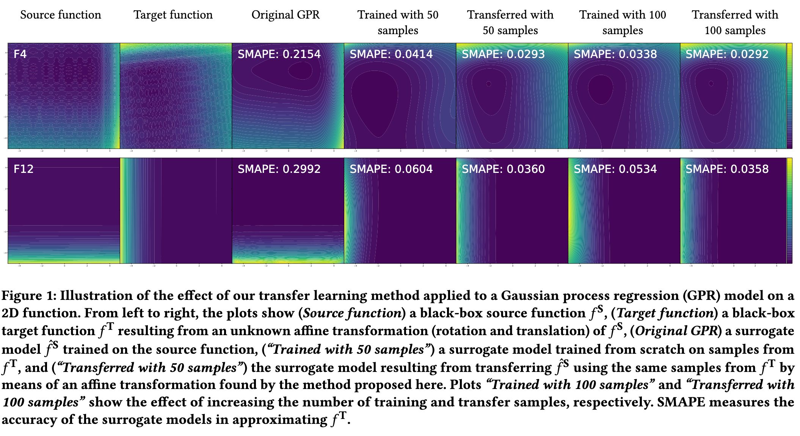

# TransferWithAffineTransformation

## Overview

This GitHub repository contains the implementation for the paper titled "Transfer Learning of Surrogate Models via Domain Affine Transformation", which has been accepted for presentation at the Genetic and Evolutionary Computation Conference (GECCO 2024). ([Learn more about GECCO 2024](https://gecco-2024.sigevo.org/HomePage))

## Abstract

Surrogate models are widely applied in many scenarios to replace expensive executions of real-world procedures. Training a high-quality surrogate model often requires many sample points, which can be costly to obtain. We would amortize this cost if we could reuse already-trained surrogates in future tasks, provided certain invariances are retained across tasks. This paper studies transferring a surrogate model trained on a source function to a target function using a small data set. As a first step, we consider the following invariance: the domains of the source and target functions are related by an unknown affine transformation. We propose to parameterize the surrogate of the source with an affine transformation and optimize it w.r.t.~an empirical loss measured with a small transfer data set sampled on the target. We select all functions from the well-known black-box optimization benchmark (BBOB) as the source and artificially generate the target with affine transformation sampled u.a.r. We experiment with a commonly used surrogate model, Gaussian process regression, where results show that the transferred surrogate significantly outperforms both the original surrogate and the one built from scratch with the transfer data set.

## Installation
pip install -r requirements.txt (The program is implemneted under the CPU server of 128 AMD Epyc 7702 cores @ 2.00GHz)

## Usage
python Riemannian_transferGP.py

## Note
For this project, the GPy, benchmarks, build, doc folders and a few python scripts (setup.py, travis_tests.py ...) contain unmodified source code from the GPy library (https://gpy.readthedocs.io/en/deploy/), which is utilized for Gaussian process regression. This inclusion is purely for functionality; thus, any references, names, or URLs present in the GPy library's code are original and not specifically related to our project.
